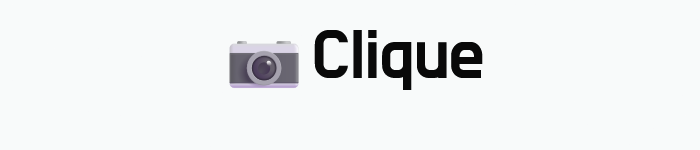
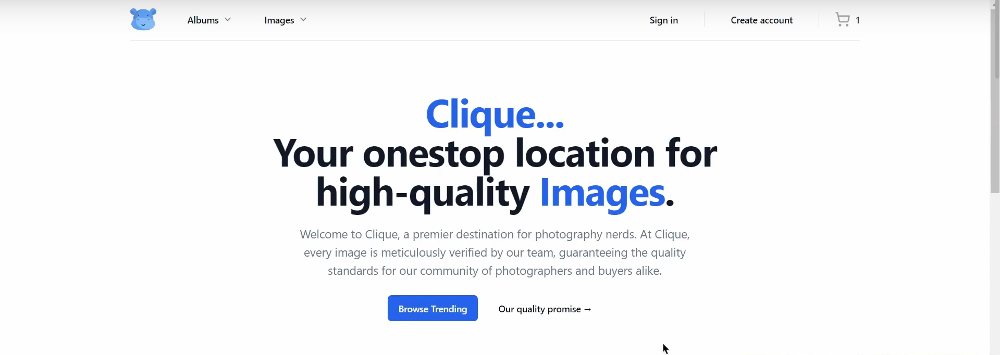
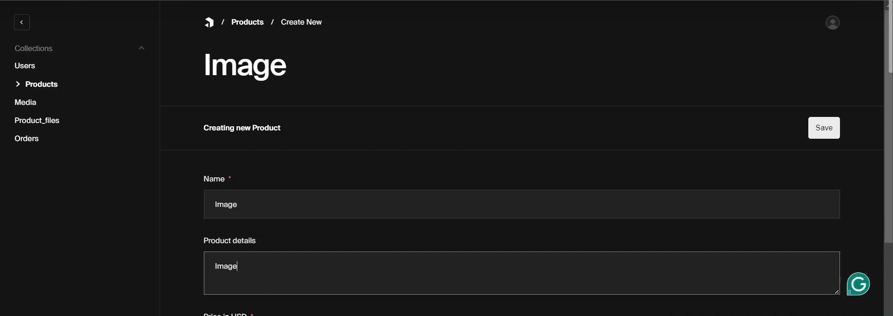
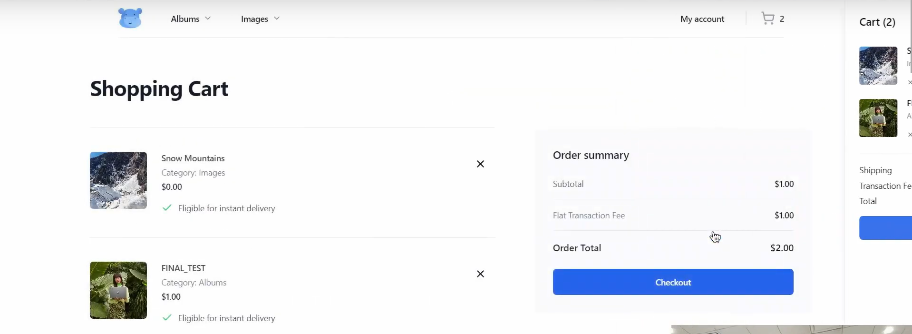
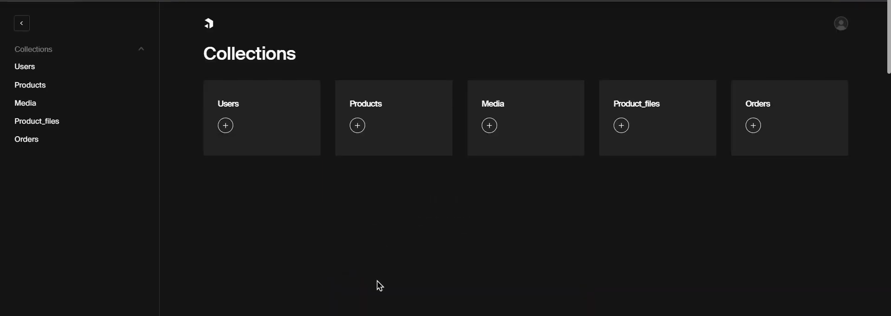

<p align="center">
  
</p>

[](LICENSE)
[](https://nodejs.org/)
[](https://www.mongodb.com/)
[](https://stripe.com/)
[](https://trpc.io/)

**Clique** is a platform for photographers to **sell their photos**, **search for ideas**, and **generate AI images** from prompts. It features a complete admin dashboard, secure payments via Stripe, and MongoDB-powered image storage.

<p align="center">
  <a href="https://www.youtube.com/watch?v=M8Q7_sCL5hY" target="_blank">
    
  </a>
</p>


## Features

- 🖼️ **Sell Images**: Photographers can upload and monetize their work.
- 🔍 **Search for Ideas**: Get inspired with image results from the **Pexels API**.
- 🤖 **AI Image Generation**: Create custom AI images using natural language prompts.
- 🛠️ **Admin Dashboard**: Built with `tRPC` for managing platform content and users.
- 💳 **Stripe Payments**: Fully integrated payment gateway.
- 🗃️ **MongoDB Storage**: Efficient and scalable image and user data handling.


## Admin Dashboard

Made using tRPC, Admins can:

- Monitor and moderate uploaded images  
- Manage photographers and users  
- Review AI-generated content  
- Handle payments and payouts via Stripe  
- View platform analytics and usage statistics  
## Screenshots

### 🔍 Home Page  
<p align="center">
  
</p>

### 📤 Upload Page  
<p align="center">
  
</p>

### 💳 Checkout  
<p align="center">
  
</p>

### 📊 Admin Dashboard  
<p align="center">
  
</p>

## Tech Stack

| Technology   | Purpose                               |
|--------------|----------------------------------------|
| **Node.js**  | Backend server and business logic      |
| **tRPC**     | Type-safe API communication            |
| **MongoDB**  | NoSQL database for storing image data  |
| **Stripe API** | Payment handling and checkout flow  |
| **Pexels API** | Photo search functionality          |
| **AI Model** | Prompt-based image generation (Stable Diffusion) |


## Installation

```bash
git clone https://github.com/BhaumikReddy/clique_project.git
cd clique
npm install
```
## Deployment

First, run the development server:

```bash
npm run dev
# or
yarn dev
# or
pnpm dev
# or
bun dev
```

Open [http://localhost:3000](http://localhost:3000) with your browser to see the result.

You can start editing the page by modifying `app/page.tsx`. The page auto-updates as you edit the file.

### Prerequisites

- Node.js v16+
- MongoDB
- Stripe API keys
- Pexels API key

Made with ❤️ by [@BhaumikReddy](https://github.com/BhaumikReddy)
